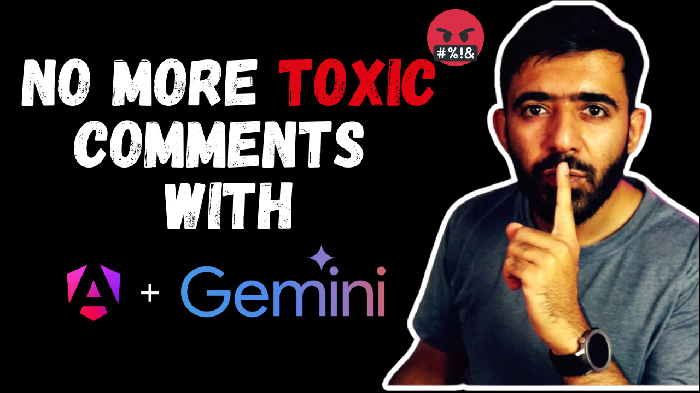

# Angular & Gemini Comment Moderation

The project demonstrates how we can use Google Gemini Models to analyze a comment from a text area and prevent users from submitting toxic comments.

[YouTube Video](https://youtu.be/QKnhgsaQGyM)

## How to use

Update the `app.config.ts` with your own [Gemini Api Key](https://aistudio.google.com/app/apikey).

> Note: do not commit your api key. especially if the repository is public

## Development server

Run `ng serve` for a dev server. Navigate to `http://localhost:4200/`. The application will automatically reload if you change any of the source files.

## Code scaffolding

Run `ng generate component component-name` to generate a new component. You can also use `ng generate directive|pipe|service|class|guard|interface|enum|module`.

## Build

Run `ng build` to build the project. The build artifacts will be stored in the `dist/` directory.

